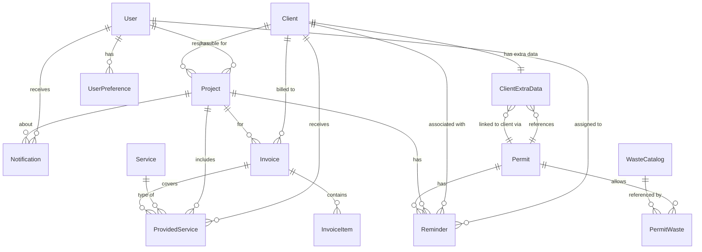

# Server Architecture Documentation

> **Ekos Green Group — Project Tracker API Server**
> Last updated: 2026-09-05

---

## Table of Contents

1. [Overview](#overview)
2. [Tech Stack](#tech-stack)
3. [Project Structure](#project-structure)
4. [Entry Point & Boot Sequence](#entry-point--boot-sequence)
5. [Database Layer](#database-layer)
6. [Authentication & Authorization](#authentication--authorization)
7. [Middleware Pipeline](#middleware-pipeline)
8. [Route Architecture](#route-architecture)
9. [Data Models (Prisma Schema)](#data-models-prisma-schema)
10. [Helper Utilities](#helper-utilities)
11. [Data Import Scripts](#data-import-scripts)
12. [Environment Configuration](#environment-configuration)
13. [Deployment](#deployment)
14. [CI/CD Pipelines](#cicd-pipelines)
15. [Coding Conventions](#coding-conventions)

---

## Overview

The Ekos Project Tracker API Server is a REST API backend for managing environmental services projects, clients, invoices, permits, waste catalog, reminders, and user accounts for **Ekos Green Group** — an environmental services company based in Kraljevo, Serbia.

The server provides:
- **User management** with role-based access control (RBAC)
- **Project lifecycle management** with sampling schedules
- **Client management** with permit associations
- **Invoice management** with line items
- **Permit management** linked to waste catalog entries
- **Waste catalog** (Serbian regulatory waste index numbers)
- **Reminder/task management** linked to projects, clients, and permits
- **Real-time notifications** for @mentions in project notes
- **Company info** management (singleton record)
- **User preferences** (key-value store per user)
- **Dashboard statistics** with aggregate counts

---

## Tech Stack

| Layer | Technology | Version |
|---|---|---|
| **Runtime** | Node.js | — |
| **Language** | TypeScript | 7.0 |
| **Framework** | Express | 5.2 |
| **ORM** | Prisma Client | 7.9 |
| **Database** | PostgreSQL | — |
| **DB Adapter** | `@prisma/adapter-pg` (native `pg` pool) | 7.10 |
| **Auth** | JWT (`jsonwebtoken`) + bcrypt (`bcryptjs`) | — |
| **Security** | `helmet`, `express-rate-limit`, `cors` | — |
| **Dev Server** | `tsx watch` (hot-reload) | 4.19 |
| **Build** | `tsc` (TypeScript compiler) | — |
| **Deployment** | Render.com (Web Service) | — |
| **CI/CD** | GitHub Actions | — |

---

## Project Structure

```
server/
├── .github/
│   ├── dependabot.yml              # Automated dependency updates
│   └── workflows/
│       ├── bump-version.yml        # PR-driven semver bumping
│       ├── deploy.yml              # Auto-deploy to Render
│       └── gitleaks.yml            # Secret scanning
├── import-export/                  # CSV/Excel data files for import scripts
│   ├── Client.csv
│   ├── dozvole_indeksi.csv         # Waste catalog import data
│   └── 2026_EGG_Količine...xlsx   # Waste disposal quantities
├── prisma/
│   ├── schema.prisma               # Database schema (source of truth)
│   ├── migrations/                 # SQL migration history
│   └── prisma.config.ts            # Prisma configuration with env loading
├── src/
│   ├── index.ts                    # Entry point — server bootstrap
│   ├── app.ts                      # Express app factory (createApp)
│   ├── db.ts                       # Prisma + pg Pool initialization
│   ├── types.ts                    # Shared enums and role-check helpers
│   ├── authUtils.ts                # JWT, bcrypt, password utilities
│   ├── seed.ts                     # Database seed script
│   ├── importClientsCsv.ts         # CSV import: clients
│   ├── importWasteCatalogCsv.ts    # CSV import: waste catalog
│   ├── importWasteDisposalExcel.ts # Excel import: waste disposal quantities
│   ├── middleware/
│   │   ├── auth.ts                 # Authentication middleware (requireAuth)
│   │   ├── errorHandler.ts         # Global error handler + asyncHandler
│   │   └── validate.ts             # Input sanitization & password validation
│   ├── helpers/
│   │   ├── dateUtils.ts            # Date arithmetic (addMonths, daysUntil, isStale)
│   │   ├── mentionHelper.ts        # @mention extraction & notification creation
│   │   └── prismaErrors.ts         # Prisma error code handler (legacy, mostly superseded)
│   └── routes/
│       ├── auth.routes.ts          # /api/auth — login, register, me
│       ├── users.routes.ts         # /api/users — CRUD, approve, reject, force-logout
│       ├── projects.routes.ts      # /api/projects — CRUD, toggle-done, sample advance
│       ├── clients.routes.ts       # /api/clients — CRUD with permit association
│       ├── invoices.routes.ts      # /api/invoices — CRUD with line items, status
│       ├── services.routes.ts      # /api/services — CRUD for service types
│       ├── categories.routes.ts    # /api/categories — CRUD for project categories
│       ├── providedServices.routes.ts # /api/provided-services — CRUD
│       ├── reminders.routes.ts     # /api/reminders — CRUD with status tracking
│       ├── permits.routes.ts       # /api/permits — CRUD linked to waste catalog
│       ├── wasteCatalog.routes.ts  # /api/waste-catalog — CRUD + auto-seed + pagination
│       ├── notifications.routes.ts # /api/notifications — list, mark-read, clear
│       ├── companyInfo.routes.ts   # /api/company-info — singleton get/put
│       ├── preferences.routes.ts   # /api/preferences — per-user key-value store
│       └── stats.routes.ts         # /api/projects/stats — dashboard aggregates
├── .env.example                    # Environment variable template
├── .env.localhost                  # Local dev config
├── .env.neon                       # Neon cloud DB config
├── package.json
├── tsconfig.json
├── render.yaml                     # Render deployment blueprint
├── CHANGELOG.md
├── SECURITY.md
└── VERSIONING.md
```

---

## Entry Point & Boot Sequence

**File:** `src/index.ts`

1. `dotenv.config()` loads environment variables.
2. `createApp()` (from `app.ts`) constructs the Express application with all middleware and routes.
3. `app.listen(PORT)` starts the HTTP server (default port: `3001`).
4. Graceful shutdown handlers are registered for `SIGTERM` and `SIGINT` — they close the HTTP server and disconnect Prisma.

**File:** `src/app.ts` — `createApp()`

The app factory performs, in order:
1. CORS (open)
2. JSON body parser (10MB for `/api/import`, 1MB for everything else)
3. Global rate limiter (1000 req / 15 min)
4. Health check endpoint (`GET /health`)
5. Root endpoint (`GET /`)
6. Auth-specific rate limiter (20 req / 15 min for login/register)
7. All 15 API route groups
8. 404 catch-all
9. Global error handler

---

## Database Layer

**File:** `src/db.ts`

- Uses the **Prisma driver adapter pattern**: a native `pg` `Pool` is created and passed to Prisma via `@prisma/adapter-pg`.
- Connection pool: max 10 connections, 30s idle timeout, 2s connection timeout.
- The `prisma` singleton is exported and used by all route files.

**Why the adapter pattern?** This allows Prisma to work with Neon serverless PostgreSQL and provides better connection pooling control.

---

## Authentication & Authorization

### Auth Flow

1. **Login** (`POST /api/auth/login`): Accepts `emailOrName` + `password`. Returns JWT token + user data.
2. **Register** (`POST /api/auth/register`): Self-registration creates a `PENDING` account (no token issued).
3. **Session validation** (`GET /api/auth/me`): Returns current user from JWT.

### JWT Implementation (`src/authUtils.ts`)

- Signing: `jsonwebtoken` with `JWT_SECRET` env var (required in production).
- Payload: `{ userId, role }`.
- Default expiration: 9 hours.
- Dev fallback secret provided for local development (with console warning).

### Password Hashing

- **Primary:** bcrypt (salt rounds: 10).
- **Legacy fallback:** PBKDF2 (SHA-512, 10000 iterations). Auto-upgrades to bcrypt on successful login.
- Legacy detection: bcrypt hashes start with `$2a$`, `$2b$`, or `$2y$`.

### Middleware (`src/middleware/auth.ts`)

- **`requireAuth`**: Extracts JWT from `Authorization: Bearer <token>` header. Resolves user from database. Attaches `req.authUser`. Returns 401 if invalid.
- **Impersonation**: Admin/Manager users can send `X-User-Id` header alongside their JWT to act as another user.
- **Force logout**: In-memory `userForceLogoutMap` stores force-logout timestamps. Tokens issued before the timestamp are rejected.
- **Online tracking**: In-memory `userActivityMap` tracks last-active timestamps (45s threshold for "online" status).

### Role-Based Access Control (RBAC)

| Role | Value | Capabilities |
|---|---|---|
| **Administrator** | `"Administrator"` | Full access. Can manage all users, assign any role. |
| **Manager** | `"Manager"` | Near-full access. Cannot create/edit/delete Administrator accounts. |
| **Accountant** | `"Accountant"` | Standard access + invoice management. |
| **User** | `"User"` | Standard access. Can only manage own projects/reminders. |

Key helper functions:
- `isAdminOrManager(role)` — used across most routes for write-access checks.
- `canManageInvoices(role)` — Admin, Manager, or Accountant.

---

## Middleware Pipeline

### `asyncHandler` (`src/middleware/errorHandler.ts`)

Wraps async route handlers to catch promise rejections and forward them to Express error handling. Every route handler should be wrapped with this.

```typescript
router.get('/path', asyncHandler(async (req, res) => { ... }));
```

### `errorHandler` (`src/middleware/errorHandler.ts`)

Global error middleware registered last. Handles:
- **P2002** (Prisma unique constraint) → 400
- **P2025** (Prisma record not found) → 404
- **Everything else** → 500 with logged error

### `sanitizeString` / `validatePassword` (`src/middleware/validate.ts`)

- `sanitizeString`: Trims strings, returns null for empty/non-string values.
- `validatePassword`: Enforces ≥8 chars, 1 uppercase, 1 lowercase, 1 digit, 1 special character.

---

## Route Architecture

All routes follow a consistent pattern:

1. Import `Router`, `prisma`, `asyncHandler`, `requireAuth`, and role helpers.
2. Create router and apply `router.use(requireAuth)` for auth-protected routes.
3. Define handlers wrapped in `asyncHandler(async (req, res) => { ... })`.
4. Check permissions using role helpers at the top of each handler.
5. Validate required fields and return 400 for missing data.
6. Perform database operations via Prisma.
7. Return JSON responses with appropriate status codes.

### Route Mounting (from `app.ts`)

| Mount Path | Route File | Auth |
|---|---|---|
| `/api/auth` | `auth.routes.ts` | Partial (login/register are public) |
| `/api/users` | `users.routes.ts` | All routes require auth |
| `/api/projects/stats` | `stats.routes.ts` | No auth (mounted before projects) |
| `/api/projects` | `projects.routes.ts` | All routes require auth |
| `/api/reminders` | `reminders.routes.ts` | All routes require auth |
| `/api/clients` | `clients.routes.ts` | All routes require auth |
| `/api/services` | `services.routes.ts` | All routes require auth |
| `/api/categories` | `categories.routes.ts` | All routes require auth |
| `/api/invoices` | `invoices.routes.ts` | All routes require auth |
| `/api/provided-services` | `providedServices.routes.ts` | All routes require auth |
| `/api/preferences` | `preferences.routes.ts` | All routes require auth |
| `/api/company-info` | `companyInfo.routes.ts` | All routes require auth |
| `/api/notifications` | `notifications.routes.ts` | All routes require auth |
| `/api/permits` | `permits.routes.ts` | All routes require auth |
| `/api/waste-catalog` | `wasteCatalog.routes.ts` | All routes require auth |

---

## Data Models (Prisma Schema)

> **Detailed Model Specification:** See [`DATA_RELATIONSHIP_MODEL.md`](DATA_RELATIONSHIP_MODEL.md) for a comprehensive field-by-field breakdown of all 16 entities, foreign key constraints, cascade rules, indices, and domain patterns.

### Entity Relationship Diagram



### Model Summary

| Model | Purpose | Key Fields |
|---|---|---|
| **User** | System users | name, email, password, role, status, isApproved |
| **UserPreference** | Per-user settings (KV store) | userId, key, value (JSON string) |
| **Project** | Environmental service projects | name, clientId, responsible, type, progress, done, nextSample |
| **Client** | Company clients | name, contactPerson, email, phone, city |
| **ClientExtraData** | Client→Permit association | clientId (unique), permitId |
| **Service** | Service type definitions | code (unique), name, group, frequency, customDataModel (JSON) |
| **Category** | Project categories | code (unique), name, description |
| **Invoice** | Client invoices | invoiceNumber (unique), status, totalAmount, currency |
| **InvoiceItem** | Invoice line items | description, quantity, unitPrice, currency |
| **ProvidedService** | Service delivery records | serviceId, clientId, status, price, customData (JSON) |
| **Reminder** | Tasks/reminders | title, status, dueDate, linked to project/client/permit/user |
| **Notification** | User notifications (@mentions) | userId, type, title, message, read, link |
| **CompanyInfo** | Company details (singleton) | Legal info, bank accounts, address |
| **Permit** | Environmental permits | permitNumber, startDate, endDate |
| **WasteCatalog** | Serbian waste index catalog | code (unique), description, isHazardous, hazardListMark, frequent |
| **PermitWaste** | Permit↔WasteCatalog junction | permitId, wasteCatalogId (unique together) |

---

## Helper Utilities

### `src/helpers/dateUtils.ts`

- **`addMonths(dateStr, months)`**: Advances an ISO date string by N months. Used for sample schedule advancement.
- **`daysUntil(dateStr)`**: Days from today to the given date. Negative = past.
- **`isStale(project)`**: Project is stale if not done AND started >2 months ago.

### `src/helpers/mentionHelper.ts`

- **`extractMentionedUserIds(content)`**: Parses HTML content for `data-user-id` attributes and `@Name` plain-text mentions. Returns array of user IDs.
- **`handleProjectNotesMentions(...)`**: Compares current vs. previous notes to find *newly* mentioned users, then creates `Notification` records for each.

### `src/helpers/prismaErrors.ts`

Legacy Prisma error handler (`handlePrismaError`). Mostly superseded by the global `errorHandler` middleware but still available for inline usage.

---

## Data Import Scripts

These are standalone scripts run via `npm run db:*` commands. They read files from `import-export/` and upsert into the database.

| Script | Command | Source File | Target Table |
|---|---|---|---|
| `importClientsCsv.ts` | `npm run db:import-clients` | `Client.csv` | `Client` |
| `importWasteCatalogCsv.ts` | `npm run db:import-waste-catalog` | `dozvole_indeksi.csv` | `WasteCatalog` |
| `importWasteDisposalExcel.ts` | `npm run db:import-waste` | `.xlsx` file | Multiple tables |

All import scripts:
- Support `:neon` suffix for running against the Neon cloud database.
- Use `DOTENV_CONFIG_PATH` to load the appropriate `.env` file.
- Are idempotent (use `upsert` operations).

---

## Environment Configuration

| Variable | Required | Default | Description |
|---|---|---|---|
| `PORT` | No | `3001` | Server listening port |
| `NODE_ENV` | No | — | `development` or `production` |
| `DATABASE_URL` | **Yes** | — | PostgreSQL connection string |
| `DB_POOL_MAX` | No | `10` | Max DB connection pool size |
| `JWT_SECRET` | **Production** | dev fallback | JWT signing secret (fatal if missing in production) |
| `JWT_EXPIRES_IN` | No | `9h` | JWT token expiration |
| `CORS_ORIGIN` | No | `*` (open) | Allowed CORS origins |
| `ENABLE_SEED` | No | `false` | Auto-seed flag |
| `DOTENV_CONFIG_PATH` | No | `.env` | Override env file path |

**Env file hierarchy:**
- `.env` — default (used in production/Render)
- `.env.localhost` — local PostgreSQL
- `.env.neon` — Neon cloud database

---

## Deployment

### Render.com

Configured via `render.yaml` blueprint:

- **Build:** `npm install && npm run build`
- **Start:** `npx prisma migrate deploy && node dist/index.js`
- **Health check:** `GET /health`
- **Auto-generated:** `JWT_SECRET`

### Deploy Trigger

Push to `main` branch triggers the GitHub Actions deploy workflow (`deploy.yml`), which calls the Render deploy hook URL (stored as `RENDER_DEPLOY_HOOK_URL` repository secret).

---

## CI/CD Pipelines

### Workflows

| Workflow | Trigger | Purpose |
|---|---|---|
| `deploy.yml` | Push to `main` | Triggers Render deployment via deploy hook |
| `bump-version.yml` | PR merge to `main` | Auto-bumps semver based on PR labels/title, updates changelog, creates Git tag and GitHub Release |
| `gitleaks.yml` | Push/PR | Scans for accidentally committed secrets |

### Dependabot

Configured in `.github/dependabot.yml` for automated npm dependency update PRs.

---

## Coding Conventions

1. **All route handlers** must be wrapped in `asyncHandler()`.
2. **Auth checks** use `requireAuth` middleware at the router level.
3. **Permission checks** use `isAdminOrManager()` or `canManageInvoices()` at the handler level.
4. **Input validation** is inline (no schema validation library). Missing required fields return 400.
5. **Duplicate checking** is done manually before create/update (not relying solely on Prisma unique constraints).
6. **Dates** are stored as ISO strings (`YYYY-MM-DD`) in `String` fields, not `DateTime`.
7. **Passwords** are never returned in API responses (destructured out).
8. **IDs** are UUIDs generated by Prisma (`@default(uuid())`).
9. **Search** is implemented via Prisma `contains` with `mode: 'insensitive'`.
10. **Deletion strategies** vary by relation:
    - `onDelete: Cascade` — child records are deleted with parent.
    - `onDelete: SetNull` — foreign key is nulled on parent delete.
    - `onDelete: Restrict` — prevents deletion if children exist.
