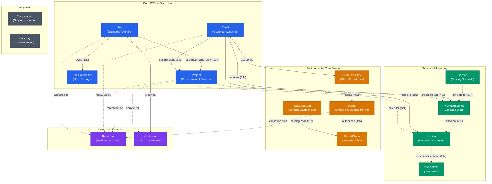
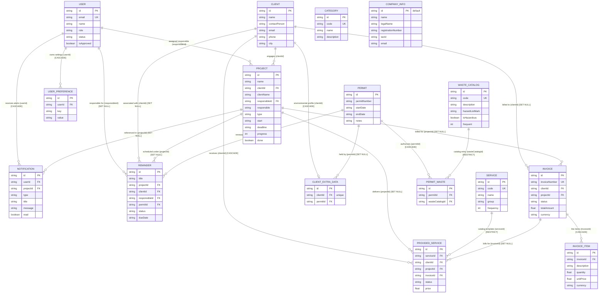

# Data Relationship Model

This document provides a comprehensive specification of the database schema, entity relationships, integrity constraints, and domain patterns for the Ekos Green Group Project Tracker API server.

---

## 1. Architectural Overview & Design Patterns

The database layer is managed with **Prisma ORM** connecting to a **PostgreSQL** database.

### Core Schema Design Principles

1. **Identifier Strategy:**
   - All models use **UUID v4** primary keys generated via `@default(uuid())`.
   - Exception: `CompanyInfo` is a single-row system configuration entity with a fixed primary key `id = "default"`.

2. **Temporal & Date Handling:**
   - **System Timestamps:** `createdAt` (`DateTime @default(now())`) and `updatedAt` (`DateTime @updatedAt`) are managed as native PostgreSQL timestamps with timezone.
   - **Business Dates:** Dates such as `start`, `deadline`, `dueDate`, `paymentDate`, `scheduledDate`, `completionDate`, and `nextSample` are stored as **ISO 8601 Date Strings** (`String?`, format `YYYY-MM-DD`). This avoids time zone shifts and serialization mismatches across clients and external reporting systems.

3. **Read Optimization via Controlled Denormalization:**
   - To avoid expensive multi-table joins on list views and search filters, related display labels are snapshot on creation:
     - `Project.clientName` (from `Client.name`)
     - `Project.responsible` (from `User.name`)
     - `Invoice.clientName` (from `Client.name`)
     - `Invoice.projectName` (from `Project.name`)
     - `Reminder.projectName`, `Reminder.clientName`, `Reminder.responsible`, `Reminder.permitNumber`
     - `Notification.authorName` (from `User.name`)
   - The foreign key references remain the authoritative relational source of truth (`clientId`, `projectId`, `responsibleId`, `permitId`).

4. **Referential Integrity & Deletion Actions (`onDelete`):**
   - **`Cascade`**: Used when child entities cannot exist without their parent:
     - `InvoiceItem` → `Invoice`
     - `UserPreference` → `User`
     - `Notification` → `User`
     - `ClientExtraData` → `Client`
     - `PermitWaste` → `Permit`
     - `ProvidedService` → `Client`
   - **`SetNull`**: Used when child entities should survive parent deletion with their relational reference cleared:
     - `Reminder` → `Project`, `Client`, `User`, `Permit`
     - `Invoice` → `Client`, `Project`
     - `ProvidedService` → `Project`, `Invoice`
     - `Notification` → `Project`
     - `ClientExtraData` → `Permit`
   - **`Restrict`**: Prevents accidental deletion of foundational catalog records when referenced:
     - `ProvidedService` → `Service` (cannot delete a base service if work was executed against it)
     - `PermitWaste` → `WasteCatalog` (cannot delete a national waste catalog code if assigned to an active permit)

---

## 2. Visual Architecture & Entity Relationship Diagrams

### 2.1. Domain Architecture Flowchart



---

### 2.2. Entity Relationship Diagram (ERD)



---

## 3. Domain Clusters & Relationship Deep-Dives

### 3.1. Core CRM & Project Operations

```
   [User] (Responsible)
      │
      ▼ (responsibleId)
  [Project] ◄──(clientId)── [Client]
      │                        │
      ├─► [Reminder] ◄─────────┤
      ├─► [Notification]       ├─► [ClientExtraData] (1:1)
      └─► [Invoice] ◄──────────┘
```

- **Client ↔ Project (1:N):**
  - A client engages zero or more projects.
  - A project optionally references a `Client` via `clientId` (`fields: [clientId], references: [id]`).
  - If a client is not yet formally registered, `Project.clientName` preserves the client identity.
- **User ↔ Project (1:N):**
  - A user acts as the responsible manager/engineer on zero or more projects via `Project.responsibleId`.
  - Display name `Project.responsible` is mirrored for fast display.
- **User ↔ UserPreference (1:N):**
  - Key-value preferences (UI theme, language, table column views) per user.
  - Compound unique constraint on `(userId, key)` ensures one value per setting key.
  - Cascade-deleted when user is removed.

---

### 3.2. Environmental Compliance & Waste Catalog

The project tracker models the Serbian national environmental waste index according to the official waste catalog (Katalog otpada):

```
[Permit] ──1:N──► [PermitWaste] (Junction) ◄──N:1── [WasteCatalog]
   │
   ├─► [ClientExtraData] (1:1 Client extension)
   └─► [Reminder] (Permit expiration alerts)
```

- **Permit ↔ WasteCatalog (M:N via `PermitWaste`):**
  - An environmental permit authorizes handling of multiple waste catalog items.
  - A single waste catalog code (e.g. `15 01 01` - paper/cardboard packaging) can appear in multiple clients' permits.
  - `PermitWaste` acts as the explicit join table:
    - Unique compound index `@@unique([permitId, wasteCatalogId])` prevents duplicate code assignments per permit.
    - `onDelete: Cascade` on `Permit`: Deleting a permit cleans up its waste mappings.
    - `onDelete: Restrict` on `WasteCatalog`: Prevents accidental deletion of standard catalog codes if linked to existing permits.
- **Client ↔ Permit via `ClientExtraData` (1:1 with Client, N:1 to Permit):**
  - `ClientExtraData.clientId` is unique (`@unique`), establishing a strict **1:1 relationship with `Client`**.
  - `ClientExtraData.permitId` is nullable and references `Permit.id` (`onDelete: SetNull`).
  - This allows clients to attach an active environmental permit without polluting the base `Client` entity table.
- **Permit ↔ Reminder (1:N):**
  - Reminders can track upcoming permit renewal deadlines (`permitId` and `permitNumber`).
  - `onDelete: SetNull` ensures reminders are preserved for audit trails even if a permit record is purged.

---

### 3.3. Services Execution & Invoicing Pipeline

```
  [Service] (Template)
      │
      ▼ (serviceId - RESTRICT)
[ProvidedService] ◄──(clientId)─── [Client]
      │           ◄──(projectId)──── [Project]
      │ (invoiceId - SET NULL)
      ▼
  [Invoice] ──1:N (CASCADE)──► [InvoiceItem]
```

- **Service (Catalog Template):**
  - Standard service definitions (e.g. "Periodic Wastewater Testing", "Waste Management Plan").
  - `customDataModel` (`Json?`): Dynamic schema specifying custom fields required when scheduling this service.
- **ProvidedService (Executed Work):**
  - Actual delivery of a service to a `Client`, optionally tied to a specific `Project` and billed on an `Invoice`.
  - `onDelete: Cascade` on `Client`: Provided services are directly bound to the client.
  - `onDelete: Restrict` on `Service`: Cannot delete a catalog service if active work orders use it.
  - `onDelete: SetNull` on `Project` and `Invoice`: Preserves historical work execution if projects or invoices are removed.
- **Invoice ↔ InvoiceItem (1:N with Cascade):**
  - Traditional master-detail invoice structure.
  - Line items are owned strictly by the invoice and cascade-deleted.
  - Invoices link back to `Client` and `Project` (`onDelete: SetNull`).

---

### 3.4. Multi-Parent Reminders

The `Reminder` model implements a flexible multi-parent pattern where a reminder can attach to one or more business contexts simultaneously:

| Foreign Key | Referenced Entity | Meaning | `onDelete` Rule |
|---|---|---|---|
| `projectId` | `Project` | Task/milestone deadline for a specific project | `SetNull` |
| `clientId` | `Client` | Client check-in, contract signing, or follow-up | `SetNull` |
| `responsibleId`| `User` | User assigned to complete or follow up on the reminder | `SetNull` |
| `permitId` | `Permit` | Renewal, inspection, or reporting deadline for an environmental permit | `SetNull` |

All four parent links are completely optional (`String?`), meaning a reminder can be a project milestone, a client task, a permit alert, or a standalone personal todo.

---

## 4. Comprehensive Model Field Specifications

### 4.1. `User`
*System users, administrators, and assigned project engineers.*

| Field | Type | Modifiers | Constraints | Description |
|---|---|---|---|---|
| `id` | `String` | Required | `@id @default(uuid())` | Primary key |
| `name` | `String` | Required | | Full display name |
| `email` | `String` | Optional | `@unique` | Login email address |
| `password` | `String` | Optional | | Salted bcrypt hash |
| `isApproved` | `Boolean` | Required | `@default(true)` | Registration approval flag |
| `status` | `String` | Required | `@default("APPROVED")` | Workflow status (`APPROVED`, `PENDING`, `REJECTED`) |
| `role` | `String` | Required | `@default("User")` | Access level (`Admin`, `User`) |
| `phone` | `String` | Optional | | Contact phone number |
| `avatarUrl` | `String` | Optional | | Link to avatar image |
| `gender` | `String` | Optional | | Gender identifier |
| `createdAt` | `DateTime` | Required | `@default(now())` | Creation timestamp |
| `updatedAt` | `DateTime` | Required | `@updatedAt` | Last modification timestamp |

**Relations:**
- `projects` → `Project[]`
- `preferences` → `UserPreference[]`
- `reminders` → `Reminder[]`
- `notifications` → `Notification[]`

---

### 4.2. `UserPreference`
*User-specific key-value application settings.*

| Field | Type | Modifiers | Constraints | Description |
|---|---|---|---|---|
| `id` | `String` | Required | `@id @default(uuid())` | Primary key |
| `userId` | `String` | Required | FK to `User.id` | Owning user |
| `key` | `String` | Required | | Setting key (e.g. `theme`, `table_density`) |
| `value` | `String` | Required | | Serialized setting value |
| `createdAt` | `DateTime` | Required | `@default(now())` | Creation timestamp |
| `updatedAt` | `DateTime` | Required | `@updatedAt` | Last modification timestamp |

**Indexes & Constraints:**
- `@@unique([userId, key])`
- `@@index([userId])`
- `onDelete: Cascade` to `User`

---

### 4.3. `Client`
*Corporate customers and partner entities.*

| Field | Type | Modifiers | Constraints | Description |
|---|---|---|---|---|
| `id` | `String` | Required | `@id @default(uuid())` | Primary key |
| `name` | `String` | Required | | Company or client legal name |
| `contactPerson` | `String` | Optional | | Primary contact representative |
| `email` | `String` | Optional | | Official correspondence email |
| `phone` | `String` | Optional | | Phone number |
| `city` | `String` | Optional | | City / Municipality |
| `createdAt` | `DateTime` | Required | `@default(now())` | Creation timestamp |
| `updatedAt` | `DateTime` | Required | `@updatedAt` | Last modification timestamp |

**Relations:**
- `projects` → `Project[]`
- `reminders` → `Reminder[]`
- `invoices` → `Invoice[]`
- `providedServices` → `ProvidedService[]`
- `extraData` → `ClientExtraData?` (1:1)

---

### 4.4. `ClientExtraData`
*Extension table holding environmental permit and regulatory mappings for a client.*

| Field | Type | Modifiers | Constraints | Description |
|---|---|---|---|---|
| `id` | `String` | Required | `@id @default(uuid())` | Primary key |
| `clientId` | `String` | Required | `@unique`, FK to `Client.id` | Unique 1:1 client reference |
| `permitId` | `String` | Optional | FK to `Permit.id` | Linked environmental permit |
| `createdAt` | `DateTime` | Required | `@default(now())` | Creation timestamp |
| `updatedAt` | `DateTime` | Required | `@updatedAt` | Last modification timestamp |

**Indexes & Constraints:**
- `@@index([clientId])`
- `@@index([permitId])`
- `onDelete: Cascade` to `Client`
- `onDelete: SetNull` to `Permit`

---

### 4.5. `Project`
*Engineering and environmental management projects.*

| Field | Type | Modifiers | Constraints | Description |
|---|---|---|---|---|
| `id` | `String` | Required | `@id @default(uuid())` | Primary key |
| `name` | `String` | Required | | Project title / name |
| `clientId` | `String` | Optional | FK to `Client.id` | Client reference |
| `clientName` | `String` | Required | | Denormalized client display name |
| `responsible` | `String` | Optional | | Denormalized responsible user display name |
| `responsibleId`| `String` | Optional | FK to `User.id` | Responsible project manager reference |
| `type` | `String` | Required | | Project type category |
| `start` | `String` | Optional | | Start date string (`YYYY-MM-DD`) |
| `deadline` | `String` | Optional | | Target completion date (`YYYY-MM-DD`) |
| `progress` | `Int` | Required | `@default(0)` | Completion percentage (0–100) |
| `done` | `Boolean` | Required | `@default(false)` | Completion status flag |
| `nextSample` | `String` | Optional | | Next sampling date string (`YYYY-MM-DD`) |
| `notes` | `String` | Optional | | Project operational notes |
| `createdAt` | `DateTime` | Required | `@default(now())` | Creation timestamp |
| `updatedAt` | `DateTime` | Required | `@updatedAt` | Last modification timestamp |

**Indexes & Constraints:**
- `@@index([clientId])`
- `@@index([responsibleId])`
- `@@index([done])`
- `@@index([type])`

---

### 4.6. `Permit`
*Environmental permits issued by government agencies for hazardous/non-hazardous waste.*

| Field | Type | Modifiers | Constraints | Description |
|---|---|---|---|---|
| `id` | `String` | Required | `@id @default(uuid())` | Primary key |
| `permitNumber` | `String` | Required | | Official permit registry number |
| `startDate` | `String` | Optional | | Issue / effective date (`YYYY-MM-DD`) |
| `endDate` | `String` | Optional | | Expiration date (`YYYY-MM-DD`) |
| `notes` | `String` | Optional | | Regulatory conditions or notes |
| `createdAt` | `DateTime` | Required | `@default(now())` | Creation timestamp |
| `updatedAt` | `DateTime` | Required | `@updatedAt` | Last modification timestamp |

**Indexes & Constraints:**
- `@@index([permitNumber])`

**Relations:**
- `reminders` → `Reminder[]`
- `clientExtraData` → `ClientExtraData[]`
- `permitWastes` → `PermitWaste[]`

---

### 4.7. `WasteCatalog`
*National regulatory catalog of waste codes (Katalog otpada).*

| Field | Type | Modifiers | Constraints | Description |
|---|---|---|---|---|
| `id` | `String` | Required | `@id @default(uuid())` | Primary key |
| `code` | `String` | Required | `@unique` | 6-digit waste code (e.g. `15 01 10*`) |
| `description` | `String` | Required | | Official legal description of waste |
| `hazardListMark` | `String`| Optional | | Hazard property indicator (e.g. `H1`, `HP14`) |
| `isHazardous` | `Boolean` | Required | `@default(false)` | Flag whether marked with asterisk (*) |
| `frequent` | `Int` | Optional | | Frequency rank for quick-search priority |
| `createdAt` | `DateTime` | Required | `@default(now())` | Creation timestamp |
| `updatedAt` | `DateTime` | Required | `@updatedAt` | Last modification timestamp |

**Indexes & Constraints:**
- `@@index([frequent])`

---

### 4.8. `PermitWaste`
*Junction table binding permits to authorized waste catalog codes.*

| Field | Type | Modifiers | Constraints | Description |
|---|---|---|---|---|
| `id` | `String` | Required | `@id @default(uuid())` | Primary key |
| `permitId` | `String` | Required | FK to `Permit.id` | Target permit |
| `wasteCatalogId` | `String` | Required | FK to `WasteCatalog.id` | Target waste catalog entry |
| `createdAt` | `DateTime` | Required | `@default(now())` | Creation timestamp |
| `updatedAt` | `DateTime` | Required | `@updatedAt` | Last modification timestamp |

**Indexes & Constraints:**
- `@@unique([permitId, wasteCatalogId])`
- `@@index([permitId])`
- `@@index([wasteCatalogId])`
- `onDelete: Cascade` to `Permit`
- `onDelete: Restrict` to `WasteCatalog`

---

### 4.9. `Service`
*Standard catalog of services offered by the company.*

| Field | Type | Modifiers | Constraints | Description |
|---|---|---|---|---|
| `id` | `String` | Required | `@id @default(uuid())` | Primary key |
| `code` | `String` | Required | `@unique` | Unique service code identifier |
| `name` | `String` | Required | | Service title |
| `group` | `String` | Required | | Group / category classification |
| `frequency` | `Int` | Required | `@default(0)` | Annual frequency expectation |
| `description` | `String` | Optional | | Service scope description |
| `customDataModel` | `Json` | Optional | | Dynamic form schema definition |
| `createdAt` | `DateTime` | Required | `@default(now())` | Creation timestamp |
| `updatedAt` | `DateTime` | Required | `@updatedAt` | Last modification timestamp |

---

### 4.10. `ProvidedService`
*Instance of an executed or planned service delivered to a client.*

| Field | Type | Modifiers | Constraints | Description |
|---|---|---|---|---|
| `id` | `String` | Required | `@id @default(uuid())` | Primary key |
| `serviceId` | `String` | Required | FK to `Service.id` | Template service reference |
| `clientId` | `String` | Required | FK to `Client.id` | Client receiving the service |
| `projectId` | `String` | Optional | FK to `Project.id` | Associated project |
| `invoiceId` | `String` | Optional | FK to `Invoice.id` | Billed invoice |
| `status` | `String` | Required | `@default("Planned")` | `Planned`, `Completed`, `Cancelled` |
| `location` | `String` | Optional | | Execution site location |
| `scheduledDate`| `String` | Optional | | Scheduled execution date (`YYYY-MM-DD`) |
| `completionDate`| `String`| Optional | | Actual completion date (`YYYY-MM-DD`) |
| `price` | `Float` | Optional | `@default(0)` | Price charged |
| `currency` | `String` | Optional | `@default("RSD")` | Currency code (`RSD`, `EUR`) |
| `notes` | `String` | Optional | | Field execution notes |
| `customData` | `Json` | Optional | | Field values matching `Service.customDataModel` |
| `createdAt` | `DateTime` | Required | `@default(now())` | Creation timestamp |
| `updatedAt` | `DateTime` | Required | `@updatedAt` | Last modification timestamp |

**Indexes & Constraints:**
- `@@index([serviceId])`
- `@@index([clientId])`
- `@@index([projectId])`
- `@@index([invoiceId])`
- `@@index([status])`
- `onDelete: Restrict` to `Service`
- `onDelete: Cascade` to `Client`
- `onDelete: SetNull` to `Project`
- `onDelete: SetNull` to `Invoice`

---

### 4.11. `Invoice`
*Billing documents and financial trackers.*

| Field | Type | Modifiers | Constraints | Description |
|---|---|---|---|---|
| `id` | `String` | Required | `@id @default(uuid())` | Primary key |
| `invoiceNumber`| `String` | Required | `@unique` | Official invoice serial number |
| `dateCreated` | `String` | Optional | | Issue date (`YYYY-MM-DD`) |
| `dueDate` | `String` | Optional | | Payment due date (`YYYY-MM-DD`) |
| `paymentDate` | `String` | Optional | | Date paid (`YYYY-MM-DD`) |
| `clientId` | `String` | Optional | FK to `Client.id` | Billed client |
| `clientName` | `String` | Optional | | Denormalized client display name |
| `projectId` | `String` | Optional | FK to `Project.id` | Billed project |
| `projectName` | `String` | Optional | | Denormalized project display name |
| `status` | `String` | Required | `@default("Draft")` | `Draft`, `Sent`, `Paid`, `Overdue` |
| `notes` | `String` | Optional | | Invoice notes |
| `totalAmount` | `Float` | Optional | `@default(0)` | Sum total amount |
| `currency` | `String` | Optional | `@default("RSD")` | Currency code |
| `createdAt` | `DateTime` | Required | `@default(now())` | Creation timestamp |
| `updatedAt` | `DateTime` | Required | `@updatedAt` | Last modification timestamp |

**Indexes & Constraints:**
- `@@index([clientId])`
- `@@index([projectId])`
- `@@index([status])`
- `onDelete: SetNull` to `Client`
- `onDelete: SetNull` to `Project`

---

### 4.12. `InvoiceItem`
*Line items within an invoice.*

| Field | Type | Modifiers | Constraints | Description |
|---|---|---|---|---|
| `id` | `String` | Required | `@id @default(uuid())` | Primary key |
| `invoiceId` | `String` | Required | FK to `Invoice.id` | Parent invoice |
| `description` | `String` | Required | | Line item description |
| `quantity` | `Float` | Required | `@default(1)` | Quantity billed |
| `unitPrice` | `Float` | Required | `@default(0)` | Price per single unit |
| `currency` | `String` | Required | `@default("RSD")` | Currency code |
| `createdAt` | `DateTime` | Required | `@default(now())` | Creation timestamp |
| `updatedAt` | `DateTime` | Required | `@updatedAt` | Last modification timestamp |

**Indexes & Constraints:**
- `@@index([invoiceId])`
- `onDelete: Cascade` to `Invoice`

---

### 4.13. `Reminder`
*Actionable alerts, follow-ups, and calendar milestones.*

| Field | Type | Modifiers | Constraints | Description |
|---|---|---|---|---|
| `id` | `String` | Required | `@id @default(uuid())` | Primary key |
| `title` | `String` | Optional | | Reminder title |
| `projectId` | `String` | Optional | FK to `Project.id` | Linked project |
| `projectName` | `String` | Optional | | Denormalized project title |
| `clientId` | `String` | Optional | FK to `Client.id` | Linked client |
| `clientName` | `String` | Optional | | Denormalized client name |
| `responsibleId`| `String` | Optional | FK to `User.id` | Assigned user |
| `responsible` | `String` | Optional | | Denormalized user name |
| `permitId` | `String` | Optional | FK to `Permit.id` | Linked permit |
| `permitNumber`| `String` | Optional | | Denormalized permit number |
| `status` | `String` | Required | `@default("Pending")` | `Pending`, `Done`, `Dismissed` |
| `notes` | `String` | Optional | | Reminder notes / details |
| `dueDate` | `String` | Optional | | Target date (`YYYY-MM-DD`) |
| `createdAt` | `DateTime` | Required | `@default(now())` | Creation timestamp |
| `updatedAt` | `DateTime` | Required | `@updatedAt` | Last modification timestamp |

**Indexes & Constraints:**
- `@@index([projectId])`
- `@@index([clientId])`
- `@@index([responsibleId])`
- `@@index([permitId])`
- `@@index([status])`
- `onDelete: SetNull` across all parent foreign keys

---

### 4.14. `Notification`
*In-app user notification feed and task mentions.*

| Field | Type | Modifiers | Constraints | Description |
|---|---|---|---|---|
| `id` | `String` | Required | `@id @default(uuid())` | Primary key |
| `userId` | `String` | Required | FK to `User.id` | Recipient user |
| `type` | `String` | Required | `@default("MENTION")` | Notification category |
| `title` | `String` | Required | | Alert headline |
| `message` | `String` | Required | | Detailed message body |
| `read` | `Boolean` | Required | `@default(false)` | Read status flag |
| `link` | `String` | Optional | | In-app navigation URL |
| `projectId` | `String` | Optional | FK to `Project.id` | Associated project |
| `authorId` | `String` | Optional | | Originating user ID |
| `authorName` | `String` | Optional | | Originating user name |
| `createdAt` | `DateTime` | Required | `@default(now())` | Creation timestamp |
| `updatedAt` | `DateTime` | Required | `@updatedAt` | Last modification timestamp |

**Indexes & Constraints:**
- `@@index([userId])`
- `@@index([read])`
- `@@index([createdAt])`
- `@@index([projectId])`
- `onDelete: Cascade` to `User`
- `onDelete: SetNull` to `Project`

---

### 4.15. `Category`
*Project and service classification taxonomies.*

| Field | Type | Modifiers | Constraints | Description |
|---|---|---|---|---|
| `id` | `String` | Required | `@id @default(uuid())` | Primary key |
| `code` | `String` | Required | `@unique` | Category identifier code |
| `name` | `String` | Required | | Human-readable category name |
| `description` | `String` | Optional | | Classification description |
| `createdAt` | `DateTime` | Required | `@default(now())` | Creation timestamp |
| `updatedAt` | `DateTime` | Required | `@updatedAt` | Last modification timestamp |

---

### 4.16. `CompanyInfo`
*Singleton organization configuration record for official invoice headers and reports.*

| Field | Type | Modifiers | Constraints | Description |
|---|---|---|---|---|
| `id` | `String` | Required | `@id @default("default")` | Fixed singleton primary key |
| `name` | `String` | Required | `@default("EKOS GREEN GROUP")` | Short trade name |
| `legalName` | `String` | Required | `@default("EKOS GREEN GROUP DOO Kraljevo")` | Full legal registered name |
| `registrationNumber` | `String` | Required | `@default("21823759")` | National business registry number (MB) |
| `taxId` | `String` | Required | `@default("113207057")` | Tax ID number (PIB) |
| `activityCode`| `String` | Required | `@default("7490 - Ostale stručne...")` | Primary business activity code |
| `municipality`| `String` | Required | `@default("KRALJEVO")` | Municipality |
| `city` | `String` | Required | `@default("KRALJEVO")` | City |
| `streetAddress`| `String`| Required | `@default("HEROJA MARIČIĆA 18")` | Street address |
| `postalCode` | `String` | Required | `@default("36000")` | Postal zip code |
| `postOffice` | `String` | Required | `@default("KRALJEVO")` | Post office city |
| `email` | `String` | Required | `@default("office@ekosgroup.rs")` | Official organization email |
| `bankAccounts`| `String[]` | Required | Default 6 Serbian accounts | Array of active bank account numbers |
| `createdAt` | `DateTime` | Required | `@default(now())` | Creation timestamp |
| `updatedAt` | `DateTime` | Required | `@updatedAt` | Last modification timestamp |

---

## 5. Relationship & Foreign Key Quick Reference

| Source Model | Field (FK) | Target Model | Cardinality | Action on Target Delete (`onDelete`) |
|---|---|---|---|---|
| `Project` | `clientId` | `Client` | N:1 | *No Action (Default)* |
| `Project` | `responsibleId` | `User` | N:1 | *No Action (Default)* |
| `UserPreference` | `userId` | `User` | N:1 | **`Cascade`** |
| `ClientExtraData` | `clientId` | `Client` | 1:1 | **`Cascade`** |
| `ClientExtraData` | `permitId` | `Permit` | N:1 | **`SetNull`** |
| `Reminder` | `projectId` | `Project` | N:1 | **`SetNull`** |
| `Reminder` | `clientId` | `Client` | N:1 | **`SetNull`** |
| `Reminder` | `responsibleId` | `User` | N:1 | **`SetNull`** |
| `Reminder` | `permitId` | `Permit` | N:1 | **`SetNull`** |
| `Invoice` | `clientId` | `Client` | N:1 | **`SetNull`** |
| `Invoice` | `projectId` | `Project` | N:1 | **`SetNull`** |
| `InvoiceItem` | `invoiceId` | `Invoice` | N:1 | **`Cascade`** |
| `ProvidedService` | `serviceId` | `Service` | N:1 | **`Restrict`** |
| `ProvidedService` | `clientId` | `Client` | N:1 | **`Cascade`** |
| `ProvidedService` | `projectId` | `Project` | N:1 | **`SetNull`** |
| `ProvidedService` | `invoiceId` | `Invoice` | N:1 | **`SetNull`** |
| `Notification` | `userId` | `User` | N:1 | **`Cascade`** |
| `Notification` | `projectId` | `Project` | N:1 | **`SetNull`** |
| `PermitWaste` | `permitId` | `Permit` | N:1 | **`Cascade`** |
| `PermitWaste` | `wasteCatalogId` | `WasteCatalog` | N:1 | **`Restrict`** |

---

## 6. Complete Index Inventory

Indexes are optimized for foreign key lookups, frequent status filtering, and sorting:

| Model | Index Target | Type | Purpose |
|---|---|---|---|
| `User` | `email` | UNIQUE | Login credential lookup |
| `UserPreference` | `[userId, key]` | UNIQUE | One setting per key per user |
| `UserPreference` | `[userId]` | INDEX | Fast load of user preferences bundle |
| `Project` | `[clientId]` | INDEX | Filter projects by client |
| `Project` | `[responsibleId]` | INDEX | Filter projects by assigned user |
| `Project` | `[done]` | INDEX | Active vs completed project tabs |
| `Project` | `[type]` | INDEX | Filter by project category |
| `ClientExtraData` | `clientId` | UNIQUE | Enforce 1:1 client extension |
| `ClientExtraData` | `[permitId]` | INDEX | Lookup clients holding a given permit |
| `Service` | `code` | UNIQUE | Service catalog identifier |
| `ProvidedService` | `[serviceId]` | INDEX | Usage audit of catalog service |
| `ProvidedService` | `[clientId]` | INDEX | Client service history |
| `ProvidedService` | `[projectId]` | INDEX | Project service scope |
| `ProvidedService` | `[invoiceId]` | INDEX | Billed services lookup |
| `ProvidedService` | `[status]` | INDEX | Scheduled vs Completed execution queue |
| `Invoice` | `invoiceNumber` | UNIQUE | Invoice identifier uniqueness |
| `Invoice` | `[clientId]` | INDEX | Client billing history |
| `Invoice` | `[projectId]` | INDEX | Project billing balance |
| `Invoice` | `[status]` | INDEX | Filter `Draft` / `Sent` / `Paid` / `Overdue` |
| `InvoiceItem` | `[invoiceId]` | INDEX | Fetch items for invoice view |
| `Reminder` | `[projectId]` | INDEX | Project reminders widget |
| `Reminder` | `[clientId]` | INDEX | Client follow-up widget |
| `Reminder` | `[responsibleId]` | INDEX | "My Reminders" dashboard filter |
| `Reminder` | `[permitId]` | INDEX | Permit expiration alerts |
| `Reminder` | `[status]` | INDEX | Active vs resolved reminder lists |
| `Notification` | `[userId]` | INDEX | User inbox query |
| `Notification` | `[read]` | INDEX | Unread badge count query |
| `Notification` | `[createdAt]` | INDEX | Chronological feed sorting |
| `Notification` | `[projectId]` | INDEX | Project activity log |
| `Permit` | `[permitNumber]` | INDEX | Permit search and autocomplete |
| `WasteCatalog` | `code` | UNIQUE | Official catalog code uniqueness |
| `WasteCatalog` | `[frequent]` | INDEX | Fast autocomplete for top waste codes |
| `PermitWaste` | `[permitId, wasteCatalogId]` | UNIQUE | Prevent duplicate code attachment |
| `PermitWaste` | `[permitId]` | INDEX | List waste codes on permit |
| `PermitWaste` | `[wasteCatalogId]` | INDEX | Find all permits authorizing waste code |
| `Category` | `code` | UNIQUE | Category code identifier |
